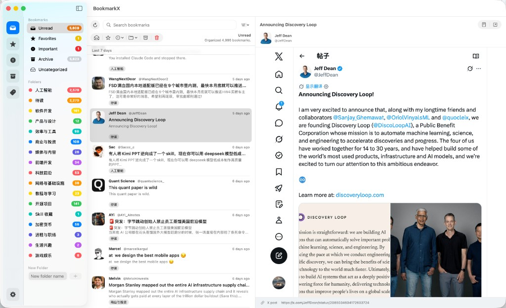
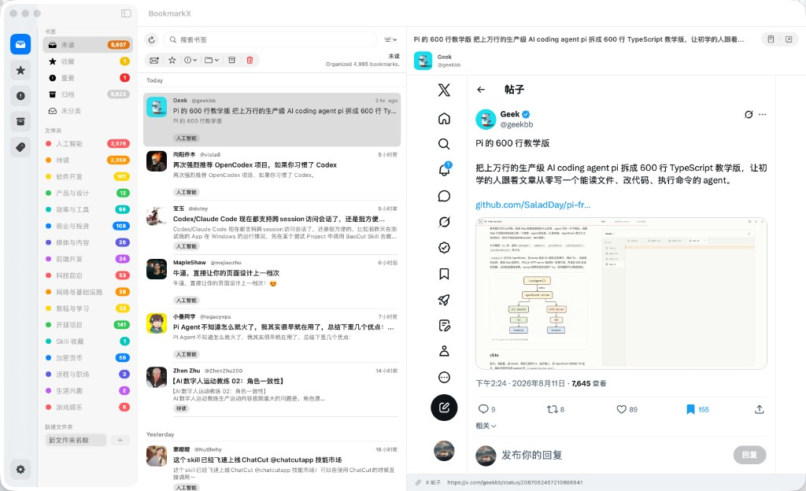

# BookmarkX

[English](#english) · [中文](#中文)

Local-first macOS app for X (Twitter) bookmarks — sync, organize, search, and summarize with Grok.

本地优先的 X（Twitter）书签管理 macOS 应用：同步、整理、搜索，并用 Grok 自动摘要与分类。

<p>
  <a href="https://github.com/williamyangcn/BookmarkX/releases/latest">
    
  </a>
  &nbsp;
  <a href="https://github.com/williamyangcn/BookmarkX/releases">
    
  </a>
  &nbsp;
  <a href="./LICENSE">
    
  </a>
</p>

**Latest:** [v0.2.4](https://github.com/williamyangcn/BookmarkX/releases/tag/v0.2.4) · [Download `BookmarkX-0.2.4.dmg`](https://github.com/williamyangcn/BookmarkX/releases/latest)

### Screenshots / 截图

| English | 中文 |
| :---: | :---: |
|  |  |

---

## English

### Screenshots


### Download

**macOS 14+ (Apple Silicon / Intel)**

| Package | Link |
| --- | --- |
| **v0.2.4 DMG** | [Download `BookmarkX-0.2.4.dmg`](https://github.com/williamyangcn/BookmarkX/releases/latest) |
| All versions | [Releases page](https://github.com/williamyangcn/BookmarkX/releases) |

1. Open the `.dmg` and drag **BookmarkX** into **Applications**.
2. On first launch, macOS may ask you to allow an unsigned/ad-hoc build: **System Settings → Privacy & Security → Open Anyway**.
3. Sign in with X inside the app, then click **Refresh** to sync bookmarks.

### What’s new in 0.2.4

- Sync no longer treats a mid-list empty page as “library finished”; stale Bookmarks IDs fall back before accepting an empty library
- Enrichment jobs queue (local folders, Grok upgrade, reclassify) instead of dropping work
- Sign-out clears WebKit cookies; post preview uses an isolated store; X OAuth tokens are never sent to x.ai
- Faster list reloads, cached avatars, web-sync media import, and tighter folder matching

### What’s new in 0.2.3

- Deep backfill resumes until the remote bookmark list is exhausted (bounded pages per refresh)
- Fix empty-library sync failure; finish the current page after catch-up skip streak (no mid-page holes)
- Sync assigns folders immediately via local classifier, then upgrades with Grok when configured
- Enrichment requests coalesce instead of silently dropping when another pass is running

### What’s new in 0.2.2

- Faster bookmark sync: stop after a streak of already-local items instead of re-walking the whole library
- Fix missing newly bookmarked posts (preserve newest-first timeline order; prefer Bookmarks GraphQL over search)
- Enrichment no longer blocks the sync spinner

### What’s new in 0.2.1

- Settings opens in a separate macOS Settings window (no longer takes over the list column)
- Manual **Move to Folder** (toolbar + context menu), including Uncategorized; manual picks are never overwritten by auto-classify
- Chinese UI localization fixes (filter menu, status, relative time follow interface language)

### What’s new in 0.2.0

- Smart folders that grow from content (not a fixed short list); one-shot rebuild for the whole library
- Column chrome: search + selection actions on the list column; preview column stays separate
- Better titles for link-only posts (`链接分享 · @user`) and auto-repair of weak / placeholder titles
- Unread / folder unread badges; Archive shows total count (no unread styling inside Archive)

### What it does

- Sync X bookmarks to a local SQLite database (IMAP-style: skip already synced, fetch up to 100 new ones per refresh)
- Four-column layout: shortcuts · folders · list · X post preview
- Unread workflow: read after 30s (font thins, count updates); next time you open Unread, read items move to Archive
- Group list by post time: Today / Yesterday / 7 days / 15 days / 1 month / This year / Last year…
- Importance, favorites, archive, delete (local or local + X) as list-column toolbar buttons (context menu still available)
- Grok enrichment: title, summary, category folder, tags (Premium quota, API key, or Auto) — local classifier fallback can invent / reuse folders
- Full-text search (FTS5)
- UI languages: English and Simplified Chinese

### Requirements

- macOS 14 Sonoma or later
- An X account (in-app web login; no Developer Client ID required for the default path)
- Optional: X Premium for Grok quota, or an [xAI API Key](https://console.x.ai/)

### Build from source

```bash
git clone https://github.com/williamyangcn/BookmarkX.git
cd BookmarkX
./Scripts/generate.sh          # needs XcodeGen
open BookmarkX.xcodeproj
```

```bash
export DEVELOPER_DIR=/Applications/Xcode.app/Contents/Developer
xcodebuild -scheme BookmarkX -destination 'platform=macOS' test
```

### Package a DMG

```bash
export DEVELOPER_DIR=/Applications/Xcode.app/Contents/Developer
./Scripts/package-dmg.sh          # → dist/BookmarkX-<version>.dmg
./Scripts/package-dmg.sh 0.2.4    # optional version tag
```

Upload the DMG on [GitHub Releases](https://github.com/williamyangcn/BookmarkX/releases/new) so the Download badge above points at a real file.

### Privacy

- Bookmarks stay on your Mac (SQLite)
- Network use is limited to X sync / login and Grok calls
- No analytics SDK
- You can delete local data anytime

### License

[MIT](./LICENSE)

---

## 中文

### 截图


### 下载

**macOS 14+（Apple Silicon / Intel）**

| 安装包 | 链接 |
| --- | --- |
| **v0.2.4 DMG** | [下载 `BookmarkX-0.2.4.dmg`](https://github.com/williamyangcn/BookmarkX/releases/latest) |
| 历史版本 | [Releases 页面](https://github.com/williamyangcn/BookmarkX/releases) |

1. 打开 `.dmg`，把 **BookmarkX** 拖进 **应用程序**。
2. 首次打开若被拦截：系统设置 → 隐私与安全性 → 仍要打开（当前为 ad-hoc 签名）。
3. 在应用内用 X 登录，然后点 **刷新** 同步书签。

### 0.2.4 更新

- 同步中途空页不再误标「全量完成」；过期 Bookmarks 接口会先尝试备用再认定空库
- 本地分类 / Grok 升级 / 全量重分类进入同一队列，不再互相丢请求
- 退出登录清除 WebKit Cookie；预览用独立 cookie 仓；不再把 X OAuth token 发到 x.ai
- 列表刷新合并、头像缓存、Web 同步导入媒体、文件夹匹配收紧

### 0.2.3 更新

- 未完成全量时自动深扫旧书签（每次刷新有页数上限）
- 修复空书签库同步失败；catch-up 跳过 streak 后仍处理完当前页，避免漏同步
- 同步后先本地分类出文件夹，已配置 Grok 时再后台升级摘要
- 富化进行中的新请求会合并排队，不再静默丢弃

### 0.2.2 更新

- 同步更快：连续遇到已本地书签后提前结束，不再整库重扫
- 修复刚收藏的帖同步不下来（保留时间线顺序；优先 Bookmarks 接口而非搜索时间线）
- 富化不再卡住同步完成状态

### 0.2.1 更新

- 设置改为独立系统设置窗口，不再占用第三栏
- 支持手工「移动到文件夹」（顶栏 + 右键），含「未分类」；手工选择后自动分类不再覆盖
- 中文界面本地化修复（筛选菜单、状态、相对时间跟随界面语言）

### 0.2.0 更新

- 文件夹可按内容智能扩展（不再死守少数几个分类）；支持整库重建文件夹
- 第三栏顶栏：搜索 + 选中书签操作按钮；第四栏预览独立顶栏
- 纯链接帖标题改为「链接分享 · @用户」；自动修复 `X Bookmark` 等弱标题
- Unread / 各文件夹显示未读数；Archive 显示归档总数（归档列表内不再强调未读样式）

### 功能

- 将 X 书签同步到本地 SQLite（类似 IMAP：跳过已同步，每次刷新最多新抓 100 条）
- 四栏界面：快捷方式 · 文件夹 · 列表 · X 帖子预览
- 未读流程：预览约 30 秒标为已读（字体变细、角标变化）；再次进入「未读」时，已读自动进入归档
- 按发帖时间分组：今天 / 昨天 / 7 天内 / 15 天内 / 1 个月内 / 今年 / 去年…
- 重要程度、收藏、归档、删除（仅本地或本地+X）；列表顶栏按钮 + 右键菜单
- Grok 整理：标题、摘要、分类文件夹、标签（Premium 额度 / API Key / 自动）；本地分类器可复用或新建文件夹
- FTS5 全文搜索
- 界面语言：简体中文、English

### 运行要求

- macOS 14 Sonoma 或更高
- X 账号（默认应用内网页登录，无需 Developer Client ID）
- 可选：X Premium（Grok 额度），或 [xAI API Key](https://console.x.ai/)

### 从源码构建

```bash
git clone https://github.com/williamyangcn/BookmarkX.git
cd BookmarkX
./Scripts/generate.sh          # 需要安装 XcodeGen
open BookmarkX.xcodeproj
```

```bash
export DEVELOPER_DIR=/Applications/Xcode.app/Contents/Developer
xcodebuild -scheme BookmarkX -destination 'platform=macOS' test
```

### 打包 DMG

```bash
export DEVELOPER_DIR=/Applications/Xcode.app/Contents/Developer
./Scripts/package-dmg.sh          # 输出 dist/BookmarkX-<version>.dmg
./Scripts/package-dmg.sh 0.2.4    # 可指定版本号
```

把生成的 DMG 上传到 [GitHub Releases](https://github.com/williamyangcn/BookmarkX/releases/new)，上方下载按钮即可指向真实安装包。

### 隐私

- 书签只存在你的 Mac（SQLite）
- 网络请求仅用于 X 同步/登录与 Grok 调用
- 无统计或追踪 SDK
- 可随时删除本地数据

### 许可证

[MIT](./LICENSE)
